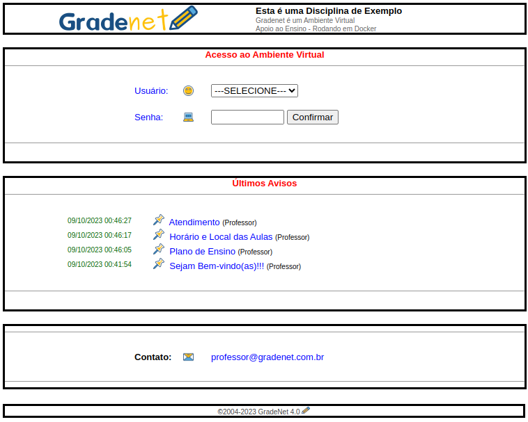
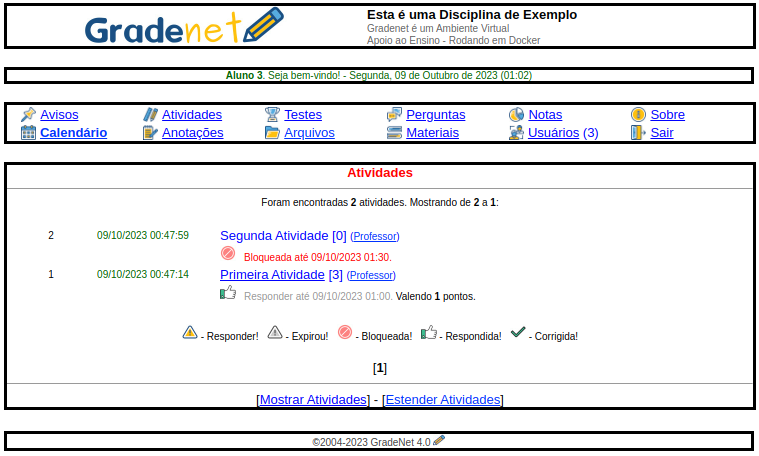

# GradeNet - Ambiente Virtual de Apoio ao Ensino

Este projeto hospeda um Ambiente Virtual de Ensino que comecei a desenvolver em 2001 quando ainda era acadêmico. Na década de 2000 o **GradeNet** foi utilizado por alguns professores da Unicentro e da Faculdade Campo Real - Guarapuava - PR. Na sequência fiz algumas adaptações e até recentemente eu estava utilizando para ministrar aulas na UTFPR. Resolvi então disponibilizar gratuitamente para quem interessar (sob a Licença MIT), talvez necessite de ajustes, o código-fonte precisa ser melhorado (*mesmo ;P*), mas quem sabe do modo que está pode ser útil para auxiliar em minicursos ou disciplinas de breve duração.

* * * 

**Passo-a-passo de como rodar o GradeNet:**

```
git clone https://github.com/hermano-utfpr/gradenet.git
cd gradenet
docker-compose up -d --build
```

Acesse via navegador: `http://localhost:8080/`

**Usuário:** Professor; **Senha:** 123456.

Um problema e a sua solução:

Ao carregar os containers em um segundo momento, poderá ocorrer falha do "cgid", para resolver basta reiniciar:

`egrep cgid web/log/error.log`

*Address already in use / cgid daemon failed to initialize.* 

`docker-compose restart`

* * * 

**Explorando o ambiente:** 

**Avisos:** Trata-se de um simples mural de avisos em geral.

**Atividades:** Para disponibilizar trabalhos, exercícios ou avaliações, com data limite e notas.

**Testes:** Permite criar testes objetivos com a possibilidade de classificar os que obtiveram melhor desempenho em um ranking.

**Perguntas:** Onde professor e alunos podem postar perguntas e respostas assim como um fórum.

**Notas:** Soma simples das notas das atividades corrigidas.

**Sobre:** Detalhes do ambiente e permite alterar as configurações gerais.

**Calendário:** Para auxiliar os usuários com as datas importantes da disciplina.

**Anotações:** Anotações particulares dos usuários.

**Arquivos:** Armazenamento particular de arquivos dos usuários.

**Materiais:** Para disponibilizar material de estudo para os alunos.

**Usuários:** Gerência de usuários do ambiente.

* * * 

**Algumas capturas de tela:**



* * * 



[Mais capturas ...](capturas/)

* * * 

**Créditos:**

[Especialização - Trabalho de Conclusão de Curso.](http://repositorio.ufla.br/jspui/bitstream/1/9549/1/MONOGRAFIA_Gradanet%20Ambiente%20virtual%20de%20apoio%20ao%20ensino.pdf)

Vectors and icons by [SVG Repo](https://www.svgrepo.com).

Se eu puder e souber como ajudar, só contatar.

Prof. Hermano

